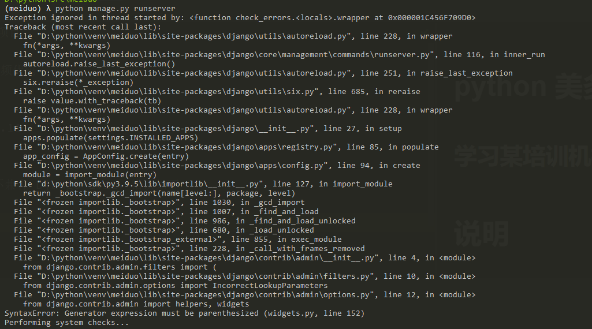

# python 美多商城项目

学习某培训机构视频代码

# 说明

## 主要软件包版本

+ Python 3.9.5
+ Django ：1.11.16
+ django-redis：4.4.4
+ Jinja2： 3.0.1
+ PyMySQL 1.0.2

## 遇到问题

1. python 高版本不兼容 Django 1.11，错误如下

解决办法[参考](https://blog.csdn.net/qq_28194001/article/details/86709006)

